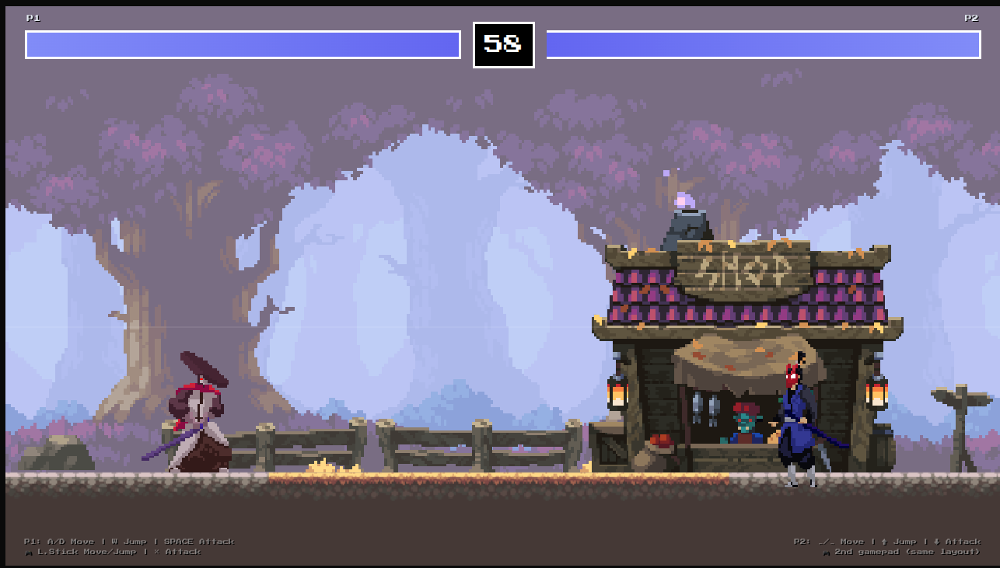

# Samurai Duel

Game aksi 2D Samurai Duel yang dibuat dengan Phaser

## Cara Menjalankan

- Install dependencies:

```
npm install
```

- Jalankan development server (Vite):

```
npm run dev
```


## Kontrol

- **Player 1:** Gerak menggunakan `W`/`A`/`S`/`D`. Tekan `Space` untuk menyerang.
- **Player 2:** Gerak menggunakan panah `←`/`↑`/`→`. Tekan panah `↓` untuk menyerang.
- Game ini juga support Game Pad! Connect kan dengan 2 gamepad untuk mabar dengan teman


kasih star pls